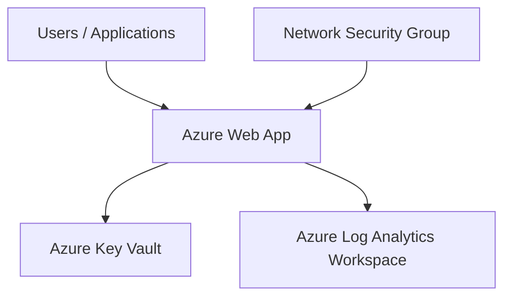

# Terraform Azure WebApp + Key Vault + Log Analytics + NSG

Enterprise-grade Terraform project designed to provision and manage Azure infrastructure components following Infrastructure as Code (IaC), security, monitoring, and governance best practices.

This repository demonstrates how to deploy a secure and scalable Azure Web Application environment integrated with Azure Key Vault, Log Analytics, and Network Security Groups (NSG) using Terraform.

---

# Architecture Overview



---

# Enterprise Features

* Infrastructure as Code (IaC) using Terraform
* Azure Web App deployment
* Azure Key Vault integration for secret management
* Centralized monitoring with Azure Log Analytics
* Network Security Group (NSG) configuration
* Security-focused cloud architecture
* Modular and reusable Terraform structure
* Enterprise cloud governance foundations
* Azure-native infrastructure provisioning

---

# Technologies Used

* Terraform
* Microsoft Azure
* Azure Web App
* Azure Key Vault
* Azure Log Analytics
* Azure Network Security Groups (NSG)
* Azure Monitor
* Infrastructure as Code (IaC)

---

# Project Structure

```text
.
├── main.tf
├── variables.tf
├── outputs.tf
├── provider.tf
├── terraform.tfvars
├── README.md
```

---

# Infrastructure Components

## Azure Web App

Deploys an Azure Web Application environment designed for scalable and managed application hosting.

## Azure Key Vault

Provides secure secret and configuration management for applications and services.

## Azure Log Analytics

Centralized monitoring and log collection for operational visibility and troubleshooting.

## Network Security Group (NSG)

Implements network security controls and traffic filtering rules.

---

# Security Considerations

This project follows cloud security and governance best practices, including:

* Centralized secret management using Azure Key Vault
* Network traffic filtering using NSGs
* Infrastructure provisioning through code
* Separation of infrastructure configuration from application logic
* Reproducible and auditable infrastructure deployments
* Security-focused Azure architecture

---

# Example Deployment Flow

```text
Terraform Init
    ↓
Terraform Validate
    ↓
Terraform Plan
    ↓
Approval
    ↓
Terraform Apply
    ↓
Azure Resource Provisioning
```

---

# CI/CD Integration Ideas

This repository can be integrated with Azure DevOps pipelines using:

* Terraform fmt
* Terraform validate
* Terraform plan
* Terraform apply
* YAML multi-stage pipelines
* Approval gates
* Variable groups
* SonarQube quality checks
* DevSecOps governance workflows
* Sonatype artifact governance

---

# Future Improvements

* Modular Terraform structure
* Multi-environment support (dev/qa/prod)
* Remote Terraform backend configuration
* Azure Managed Identity integration
* Application Insights integration
* Automated CI/CD deployment pipelines
* RBAC role assignments
* Azure Policy integration
* Reusable Terraform modules

---

# Purpose

This repository was created to demonstrate practical experience with:

* Azure cloud infrastructure
* Infrastructure as Code (IaC)
* Enterprise cloud architecture
* Terraform automation
* Azure governance and security concepts
* Enterprise DevOps practices
* Monitoring and observability
* Azure platform engineering

---

# Author

Adriano Alves da Silva

Infrastructure | Azure | DevOps | Terraform | PowerShell | Enterprise Automation
